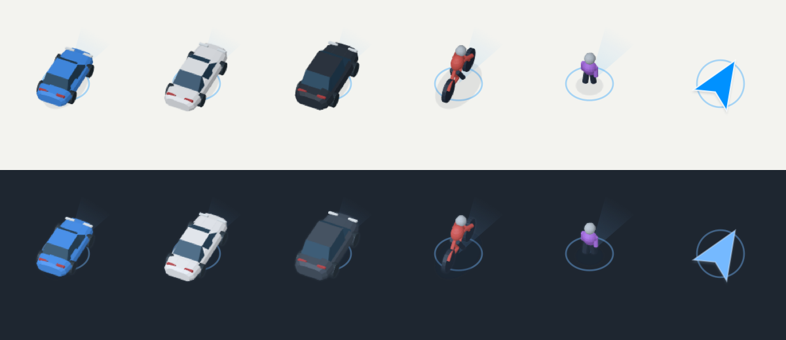
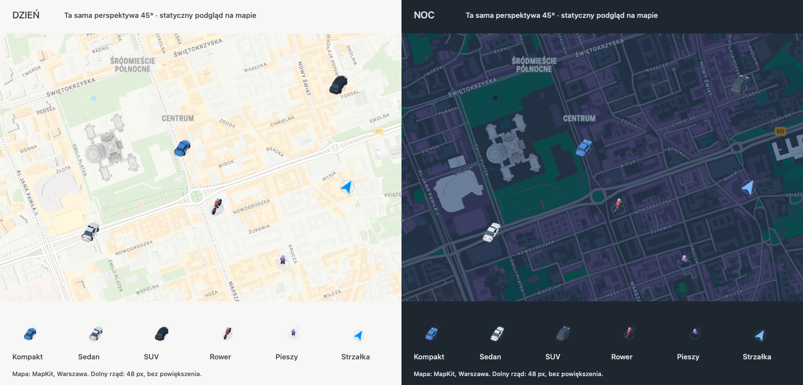
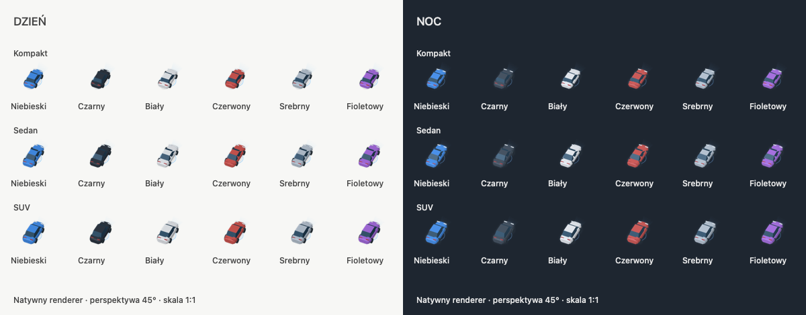

# Personalizowany znacznik pozycji

Ustawienia → Twój znacznik pozwalają wybrać model albo klasyczną strzałkę.
Samochód ma trzy różne sylwetki: krótki kompakt, niski sedan z dłuższym bagażnikiem
i wyższy, szerszy SUV. Rower i pieszy mają po jednej uproszczonej sylwetce.
Każdy z tych sposobów podróży ma osobny zapis koloru. Dostępne kolory to
niebieski, czarny, biały, czerwony, srebrny i fioletowy.

Klasyczna strzałka ma osobny wybór tych samych sześciu kolorów, widoczny po
wybraniu „Strzałka”. Jej kolor jest zapisywany niezależnie od kolorów modeli;
starszy zapis ustawień bez koloru strzałki zachowuje pozostałe wybory i przyjmuje
niebieską strzałkę. Podgląd oraz mapy iOS i macOS używają wybranego koloru.

Wielkość znacznika można zwiększyć. Wybór modelu nie zmienia profilu wyznaczania trasy.
Dotychczasowy przełącznik `transportPositionIconsEnabled` zachowuje znaczenie:
wyłączony pozostawia strzałkę, włączony pokazuje modele. Preferencje wyglądu są
zapisywane lokalnie jako `navigationMarkerAppearance`.

Zapisany wcześniej wariant kombi jest prezentowany jako sedan, a rower sportowy
jako wspólny model roweru. Pozostałe preferencje, w tym kolor i wielkość, zostają
zachowane. Dawne identyfikatory kolorów nadal można odczytać.

Komunikacja i P+R korzystają z istniejącego rozpoznawania etapu podróży.
Autobus, tramwaj, pociąg lub prom pojawiają się na odpowiednim etapie oznaczonym
jako jazda pojazdem; dojście i oczekiwanie pokazują pieszego. Brak rozpoznanego
etapu nie implikuje wejścia do pojazdu. Motocykl i skuter nie są dodawane jako
profile trasy ani jako opcje wyglądu nieobsługiwanego sposobu podróży.

## Prezentacja i dane

- `NavigationPuckEngine` nadal wyznacza pozycję prezentacji. Wygląd nie wpływa
  na postęp, wykrywanie zjazdu z trasy, ETA ani dotarcie do celu.
- `NavigationMarkerAppearance` definiuje katalog, kolory, wielkość i zapis.
- `NavigationMarkerPresentation.resolve` wybiera model, orientację i jakość
  na podstawie rzeczywistego stanu nawigacji. Kamera jest uwzględniana osobno.
- `NavigationMarkerArtwork` zawiera autorskie bryły 3D i projekcję do obrazów
  2.5D. Poza pochyleniem są obracane płynnie; w perspektywie ujęcia są
  próbkowane co 5 stopni. Cache obrazów ma budżet kosztu 12 MiB; geometria
  jest współdzielona między ujęciami. Modele nie wymagają sieci ani silnika 3D.
- `NavigationMarkerNativeView` rysuje model, ring, kierunek i jakość jako
  warstwy natywne. iOS/MapLibre i macOS/MapKit korzystają z tego samego widoku;
  SwiftUI nie otrzymuje klatek pozycji do ponownego budowania interfejsu.

Kotwica podłoża i środek ringu leżą na współrzędnych użytkownika. Wysokość
modelu przesuwa jego sylwetkę w projekcji, bez przesuwania współrzędnych.
Ring ma cienki, częściowo przezroczysty obrys bez wypełnienia; w perspektywie
spłaszcza się wraz z pochyleniem kamery. Ma stałą wielkość ekranową i nie
reprezentuje promienia dokładności GPS.
Istniejący obszar dokładności na mapie pozostaje oddzielnym elementem.

Model wskazuje kierunek ruchu swoją sylwetką, uzupełnioną delikatnym gradientem
wychodzącym spod jego kotwicy do przodu. Nad modelem nie ma osobnej strzałki.
Klasyczna strzałka pozostaje samodzielną alternatywą. Sektor przy pieszym
prezentuje kierunek telefonu, jeżeli jest dostępny w stanie nawigacji; nie
deklaruje orientacji ciała ani obszaru widoczności. Przerywany obrys i wykrzyknik sygnalizują słabą,
przewidywaną lub nieaktualną pozycję. Po 5 sekundach bez świeżego pomiaru
poświata kierunku jest ukrywana; model zachowuje ostatnią orientację. Po ponad
30 sekundach jest dodatkowo przygaszany. Predykcja pozycji nadal podlega
istniejącemu limitowi silnika. Brak internetu nie jest stanem braku GPS.

Przy małym zoomie model jest zmniejszany z histerezą 13.2/13.8. Podgląd trasy
pokazuje neutralny znacznik faktycznej pozycji, niezależnie od początku planu.
Przy braku kierunku neutralny znacznik ma centralny punkt, bez sugerowania kursu.
Pełne modele dotyczą aktywnej nawigacji i reroutingu. Osobny tryb ciągłej
jazdy bez celu nie jest wprowadzany przez zmianę wyglądu.

Pętla mapy korzysta z istniejącej polityki klatek i jest wyłączana w tle.
Nie ma animacji dekoracyjnych ani implicit animations warstw. Większy kontrast
wzmacnia ring; kolor nie jest jedynym oznaczeniem jakości. Ustawienia używają
wspólnej powierzchni Glass i tego samego renderera co mapa. Przykładowa mapa
w ustawieniach jest jawnie oznaczonym lokalnym podglądem wyglądu.

## Spójność wyglądu i podglądy

Wszystkie sylwetki korzystają z tej samej projekcji, światła i kotwicy podłoża.
Podglądy poniżej używają pochylenia 45°; na mapie perspektywa dostosowuje się do
rzeczywistej kamery. Bryły aut podkreślają dach, szyby i światła bez drobnych
detali karoserii. Rowerzysta i pieszy mają neutralne głowy i uproszczone kończyny.

Motyw dzienny ma delikatny cień i ciemniejsze powierzchnie boczne. Motyw nocny
rozjaśnia refleksy, dodaje chłodne światło do materiału oraz subtelną poświatę
krawędzi. Czarny lakier otrzymuje mocniejszy chłodny refleks dla czytelności.
Obrys lokalizacji i poświata kierunku również zmieniają intensywność z motywem;
modele nie otrzymują mocnej białej obwódki.

Drugi obraz zestawia natywny renderer ze statycznymi mapami centrum Warszawy
uzyskanymi przez MapKit w jasnym i ciemnym motywie. Pozycje modeli są ilustracyjne;
nie są zapisem rzeczywistego przejazdu. Dolny rząd ma rozmiar 48 px bez powiększenia.
Podgląd służy ocenie sylwetek i kontrastu, nie potwierdza zachowania GPS ani
wydajności podczas jazdy. Osobny arkusz pokazuje wszystkie sześć kolorów aut:

